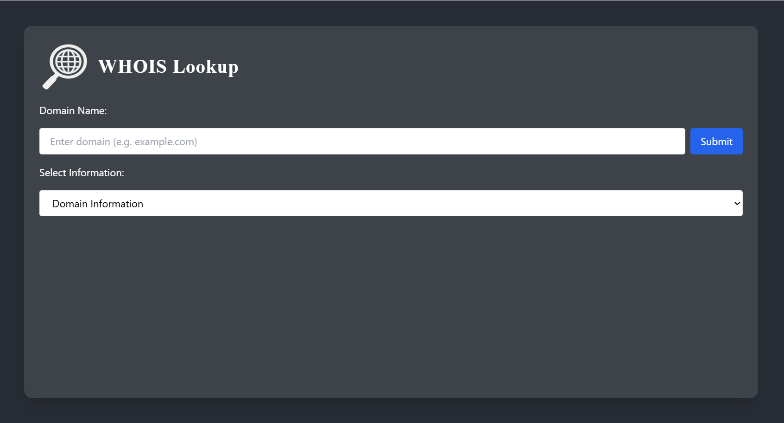

# WHOIS Lookup - Full Stack Assignment

A full-stack WHOIS lookup app using **Flask** (backend) and **React + Tailwind CSS** (frontend).  
Retrieves domain registration and contact information from the WhoisXML API.

---

## 📌 Table of Contents

- [Features](#features)
- [Tech Stack](#tech-stack)
- [Project Structure](#project-structure)
- [Setup Instructions](#setup-instructions)
- [Environment Variables](#environment-variables)
- [Preview](#preview)
- [Notes](#notes)

---

## 🚀 Features

- Input a domain name to fetch WHOIS data
- Toggle between Domain Info and Contact Info
- Dark theme styled with Tailwind CSS
- Hostname truncation over 25 characters
- Graceful error handling and loading indicators
- Responsive single-page UI

---

## 🛠 Tech Stack

| Layer     | Tech                 |
|-----------|----------------------|
| Frontend  | React, Tailwind CSS  |
| Backend   | Flask, Python, Requests |
| API       | WhoisXML API         |

---

## 🗂 Project Structure

```
whois-lookup/
├── client/
│   ├── public/
│   ├── src/
│   ├── .env
├── server/
│   ├── app.py
│   ├── .env
│   ├── requirements.txt
├── .gitignore
├── README.md
```

---

## ⚙️ Setup Instructions

> ✅ Prerequisites: Python 3.7+ and Node.js 16+

---

### 1. Clone the Repository

```bash
git clone https://github.com/Kira-Saints/whois-lookup.git
cd whois-lookup
```

---

### 2. Backend Setup (Flask)

```bash
cd server
python -m venv venv
source venv/bin/activate      # On Windows: venv\Scripts\activate
pip install -r requirements.txt
cp .env .env
```

Edit `.env` and add your WhoisXML API key:
```env
WHOIS_API_KEY=your_actual_api_key_here
```

Or use this test key for evaluation:

```env
WHOIS_API_KEY=at_huzCphF4yAnCrxNCiwvObMN3OxBWS
```

> ⚠️ This key is for demonstration only and may be rate-limited.

Start the backend server:
```bash
python app.py
```

> 🟢 Backend will run at: `http://localhost:5000`

---

### 3. Frontend Setup (React)

In a **new terminal window**:

```bash
cd client
npm install
cp .env .env
```

Edit `.env`:
```env
REACT_APP_API_URL=http://localhost:5000
```

Start the React app:
```bash
npm start
```

> 🌐 Frontend will open at: `http://localhost:3000`

---

## 🌍 Environment Variables

These should be set up locally and **not committed**.

### `server/.env`
```env
WHOIS_API_KEY=your_api_key_here
```

### `client/.env`
```env
REACT_APP_API_URL=http://localhost:5000
```

---

## 📁 .gitignore

Ensure this is in your root `.gitignore` to prevent secrets from being committed:

```gitignore
.env
**/.env
.env.local
.env.development.local
.env.test.local
.env.production.local
client/.env
server/.env
```

---

## 🖼 Preview



---

## 📝 Notes

- Each API request fetches either domain info or contact info, as per instructions
- Frontend makes both requests once and toggles view without re-submission
- All API keys are safely managed via `.env`

---

© 2025 Kira Saints. All rights reserved.